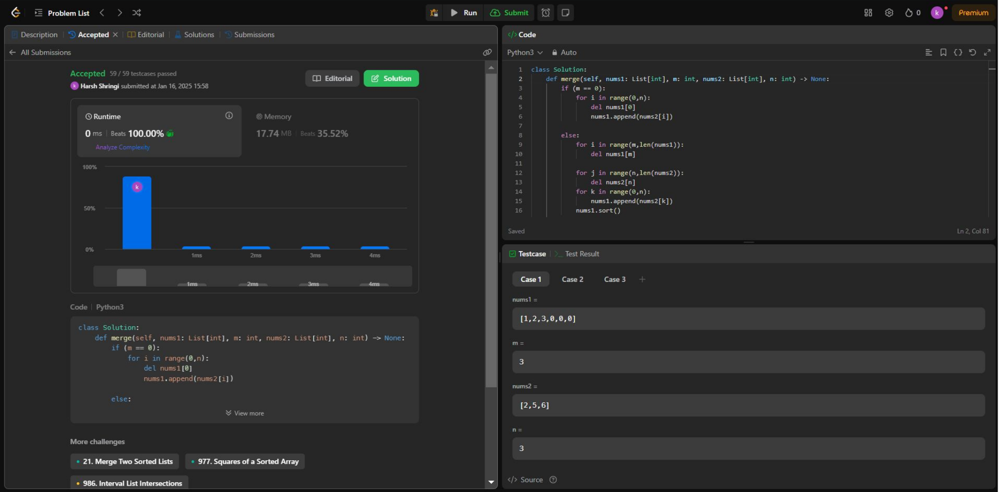

# 100-days-of-code

🚀 DAY1/100 of Coding-Challenge

Today's question: Merging Two Sorted Arrays 
Given: Two sorted arrays, nums1 and nums2, along with two integers m and n, representing the number of elements in nums1 and nums2, respectively.

Objective: Merge the two arrays into one sorted array.

Constraints: The result must be stored inside nums1, which has enough space (filled with zeros) to accommodate all elements from nums2.

